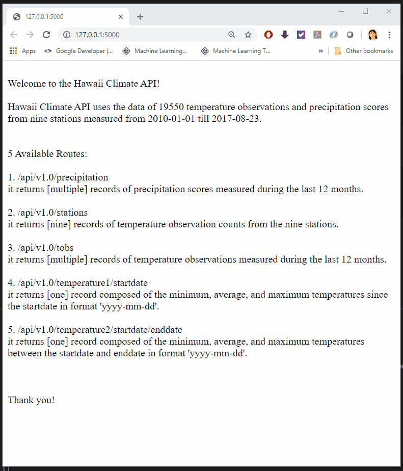
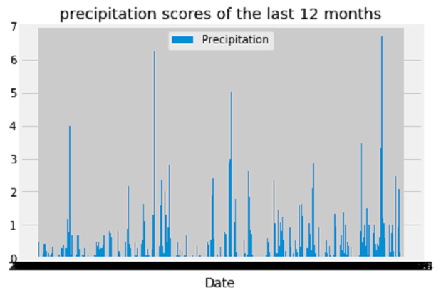
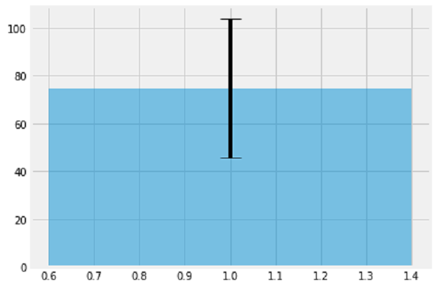

# Analyze And Visualize Hawaii Weather

This project used **Pandas**, **Matplotlib**, **Flask**, **SQLAlchemy** and **SQLite** to do basic climate analysis and data exploration of the Hawaii climate sqlite database.
   
- - -

- - -

## Technologies Used

* Python data manipulation and analysis library **Pandas** offers data structures and operations for manipulating numerical tables and time series.

* **Matplotlib** is a `plotting library` for the Python programming language and its numerical mathematics extension NumPy. 

* Python web framework **Flask** is used for generating routes. Flask uses the method route() to bind functions to a URL. Modern web frameworks use the routing technique to help a user remember application URLs. It is useful to access the desired page directly without having to navigate from the home page.

* Python web framework *Flask*'s extensions **Jsonify** can serialize the data passed to it to JSON list.

*  **SQLAlchemy** is a Python SQL toolkit and Object Relational Mapper(ORM). It can do Object-Relational mapping with the SQLite database. Its `create_engine()` is used to connect to the sqlite database and its `automap_base()` is used to reflect tables in the SQLite database into python classes.

* **SQLite** is a lightweight embedded relational database which direct I/O to disk and needs Zero-configuration.

## Project Files:

* **ClimateAnalysisAndDataExploration.ipynb**: Using SQLAlchemy connnect to weather SQLite database, reflect the tables into SQLAlchemy ORM, do `session.query()` then use pandas to do exploratory climate analysis.  

* **ClimateApp.py**: This server generates five routes. In each route function the query results are passed to `jsonify()` and it returns a JSON list. The input argument the route functions take is a URL rule and it needed to be matched for being triggered.
 
* **hawaii.sqlite**: Hawaii weather database.

## Final Results

By sending requests from **Brower** to the **Flask Server** can get below results: 

- - -

